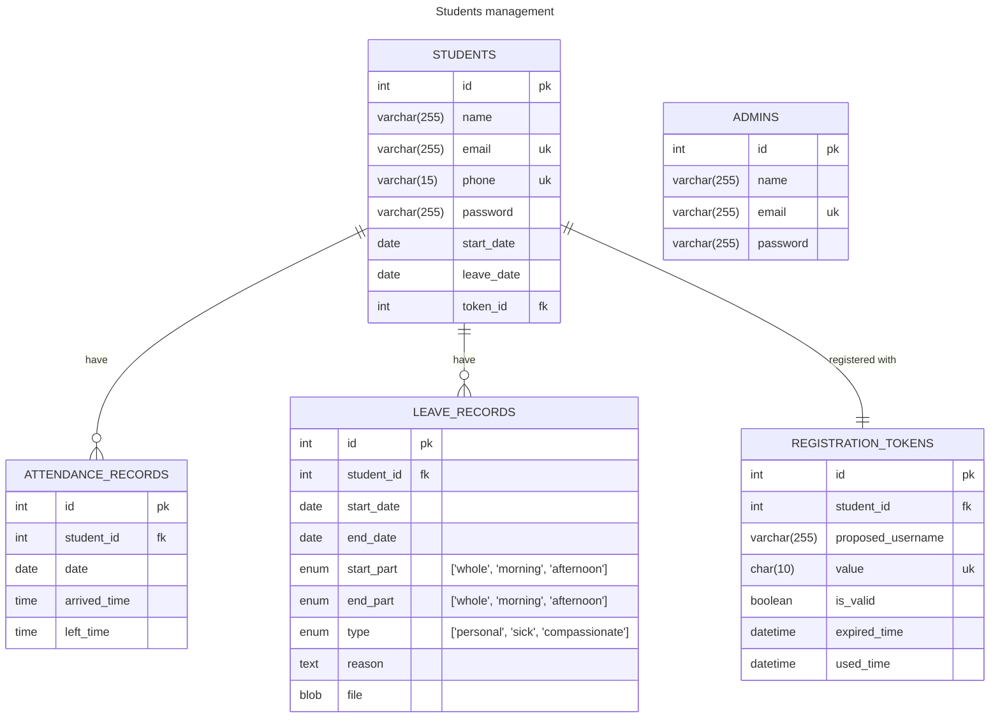

# student_management

This project is under development

client: vanilla JavaScript with VScode extension Live Preview   
server: Laravel Breeze API stack

ERD below is written in Mermaid

```mermaid
---
title: Students management
---
erDiagram
    STUDENTS ||--o{ ATTENDANCE_RECORDS : "have"
    STUDENTS ||--o{ LEAVE_RECORDS : "have"
    STUDENTS ||--|| REGISTRATION_TOKENS : "registered with"

   ADMINS {
    int id pk
    varchar(255) name
    varchar(255) email uk
    varchar(255) password
   }

   STUDENTS {
    int id pk
    varchar(255) name
    varchar(255) email uk
    varchar(15) phone uk
    varchar(255) password
    date start_date
    date leave_date
    int token_id fk
   }

  ATTENDANCE_RECORDS {
    int id pk
    int student_id fk
    date date
    time arrived_time
    time left_time
  }

  LEAVE_RECORDS {
    int id pk
    int student_id fk
    date start_date
    date end_date
    enum start_part "['whole', 'morning', 'afternoon']"
    enum end_part "['whole', 'morning', 'afternoon']"
    enum type "['personal', 'sick', 'compassionate']"
    text reason
    blob file
  }

  REGISTRATION_TOKENS {
    int id pk
    int student_id fk
    varchar(255) proposed_username
    char(10) value uk
    boolean is_valid
    datetime expired_time
    datetime used_time
  }
```